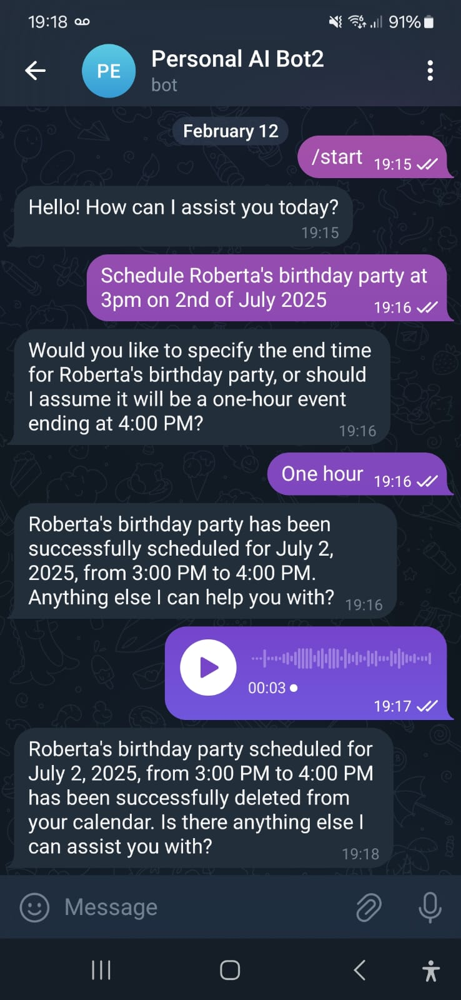
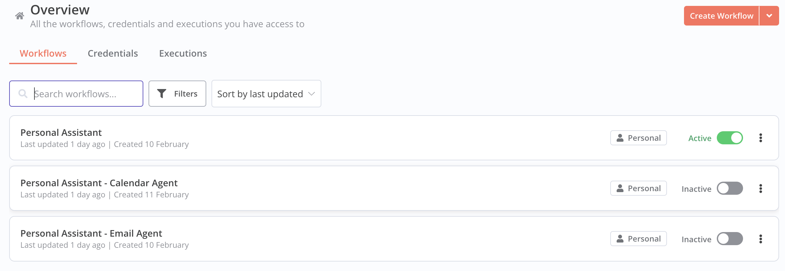
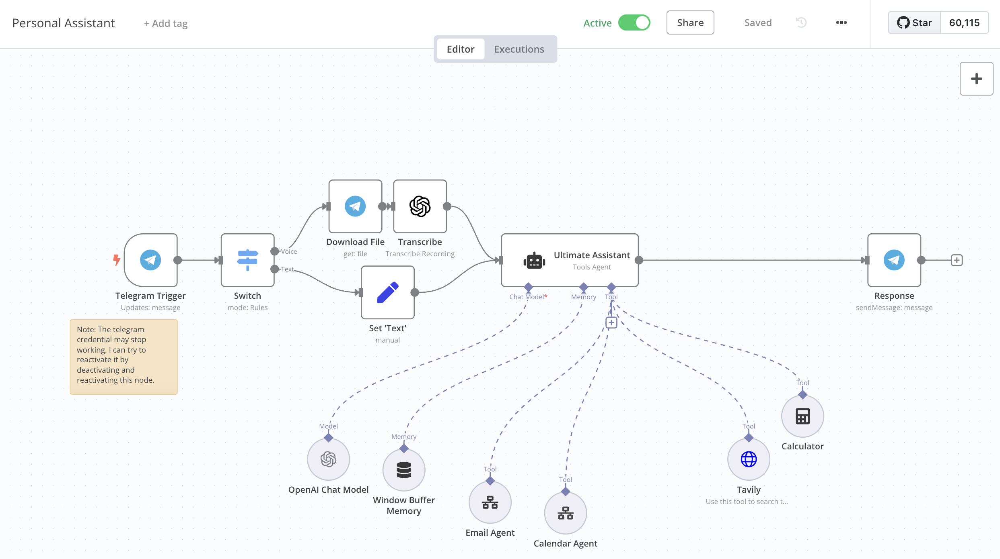
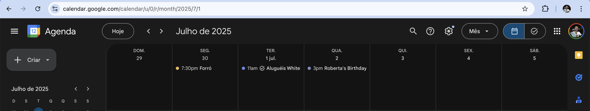

# Personal Assistant AI

## About the Project

Personal Assistant AI is an application designed to manage your emails, schedule calendar events, and perform various other functions through a Telegram bot interface. It leverages **n8n** workflows and **OpenAI’s LLM** to interpret user requests and execute actions through **agents**, such as scheduling events or drafting emails.

---

## Application Functionality Preview

1. **User Interaction via Telegram**: The user sends a message or voice note to the Telegram bot.

#### Telegram Chat Interface (text and voice)

  

2. **AI Processing**:  
   - If the request is a general inquiry, the system leverages the **OpenAI LLM** to provide an instant response.
   - If the request involves performing an action (like scheduling an event), the workflow dispatches the request to the appropriate **agent** to handle it.

#### Workflows List on n8n

#### Main Router Workflow on n8n

3. **Example Requests**:
   - “Schedule Roberta's birthday party at 3pm on 2nd of July 2025.”
   - “Cancel Pedro’s birthday event on April 1.”
   - “Draft an email to example@gmail.com saying ‘Good morning.’”
   - “Send an email to example@gmail.com confirming the trip.”

#### Updated Google Agenda for (“Schedule Roberta's birthday party at 3pm on 2nd of July 2025.”)

4. **Response**: The user immediately receives a Telegram message confirming the outcome or providing the requested information.

---

## Setup

If you already have an **active n8n server** running over HTTPS in a subdomain, you can skip directly to step **2. Creating the Telegram Chat Bot**.

### 1. Setting Up n8n on a Server with HTTPS

- You need **n8n** running on a server accessible over **HTTPS** to integrate with the Telegram Bot.
- You can set up a free HTTPS server using:
  - AWS EC2 (Free Tier)
  - [DuckDNS](https://www.duckdns.org/) for Dynamic DNS
- Follow the steps and download necessary files from this repository: [n8n-free-setup](https://github.com/ferriblima/n8n-free-setup). 

Once you have your server configured, ensure it is accessible via a secure URL (e.g., `https://subdomain.example.com`).

### 2. Creating the Telegram Chat Bot

1. Open a conversation with **BotFather** (Telegram's bot manager).
2. Send the command `/newbot` to create a new bot.
3. Respond to BotFather’s questions with your desired bot name and unique username.
4. Save the **API key** provided by BotFather.
5. Open a chat with your newly created bot to initialize the conversation.

### 3. Setup Flows in n8n

1. Access your **n8n** dashboard at the URL you configured (e.g., `https://subdomain.example.com`).
2. Create an account in n8n if you haven’t already.
3. Create a new workflow for each of the `.js` workflow files located in the `n8nWorkflows` folder of the repository. Import those workflow files into the corresponding new workflows.
4. The **Personal Assistant** workflow will serve as the main router for requests to specific agent workflows. In this main workflow:
   - Create your **Telegram credentials** in the Telegram Trigger node.  
     For more information, check the official [n8n Telegram documentation](https://docs.n8n.io/integrations/builtin/app-nodes/n8n-nodes-base.telegram/).
5. Create an **OpenAI** account (you will receive \$5 in free credits for testing), generate an **API key**, and then create an **OpenAI credential** in n8n. Attach this credential in the **OpenAI node** within your workflow.
6. In the **Personal Assistant** workflow, create new **Call n8n Workflow** nodes for each agent you will use. Assign the same name as defined in the prompt of the “Ultimate Assistant” node for each corresponding agent workflow.
7. Open each **agent workflow** and configure the required credentials.  
   - For **Google** services (e.g., Gmail, Calendar), use **OAuth2** authentication. A service account typically won’t work out-of-the-box for these flows.  
   - Enable the relevant Google APIs (e.g., Gmail API, Calendar API) in your Google Cloud project.

For a complete video tutorial, watch [Nate Herk’s guide](https://www.youtube.com/watch?v=9FuNtfsnRNo). Credits to [Nate Herk](https://www.youtube.com/@nateherk).

---

## Built With

- [n8n](https://n8n.io/)
- [OpenAI](https://openai.com/)
- [Telegram Bot API](https://core.telegram.org/bots/api)
- [Google APIs](https://console.cloud.google.com/) (for Gmail, Calendar, etc.)

---

## Acknowledgments

- [Nate Herk](https://www.youtube.com/@nateherk) for the detailed n8n tutorial.
- [OpenAI](https://openai.com) for the language models.
- [n8n Documentation](https://docs.n8n.io/) for guidance on workflow automations.

---

## License

This project is provided under an MIT license. See the [LICENSE](LICENSE) file for details.
